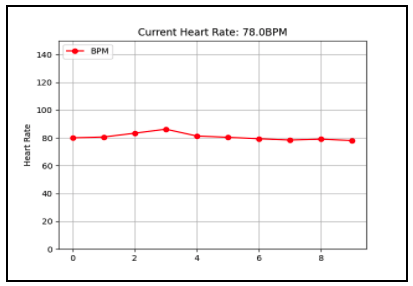
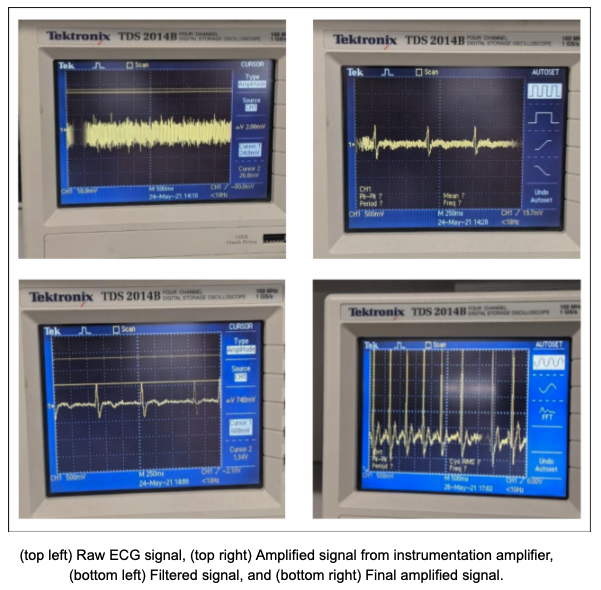

# Aim
The aim of this project was to build an ECG amplifier using digital signal processing in software that works synergistically with readily available hardware components. Raw ECG signals are collected, processed, and displayed in real-time using an Arduino as a microcontroller and a python script as middleware. This report provides the design decisions, calculations and results obtained.

# Real-time Heart Rate plot output

  

# Block Diagram

  

# Components
| Component Type     | Specification |
| ----------- | ----------- |
| Instrumentation Amplifier | INA114A       |
| Op-Amp   | LMC660 Quad Op-Amp        |
| Resistors   | 1x470kΩ, 3x2.2kΩ, 5x10kΩ, 1x100Ω       |
| Capacitors  | 4x10μF        |
| Batteries  | 2x9V       |
| Microcontroller   | Arduino Uno        |
| ECG Electrodes  | 3 x 4mm banana to clip       |
| Breadboard   | 2 x mini-standard (83mmx55mm)       |

# Final Circuit
## Bread board

  

## LTspice

  

# Analog signal precessing results 
After each filtering stage:

  

# Digital signal precessing results 

  

